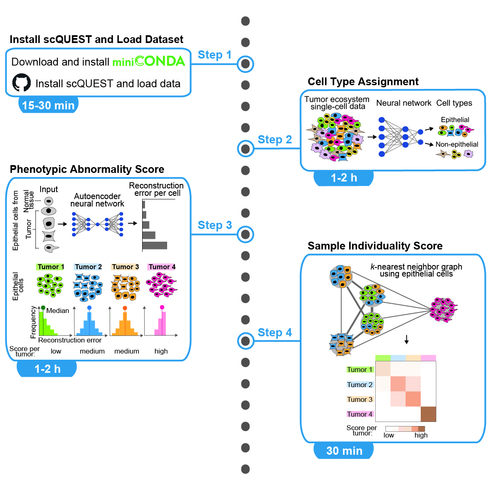

# scQUEST: Quantifying tumor ecosystem heterogeneity from mass or flow cytometry data

[](https://travis.ibm.com/art-zurich/scQUEST)
[](https://ai4scr.github.io/scQUEST/)

With mass and flow cytometry, millions of single-cell profiles with dozens of parameters can be measured to comprehensively characterize complex tumor ecosystems. Here, we present scQUEST, an open-source Python library for cell type identification and quantification of tumor ecosystem heterogeneity in patient cohorts. We provide a step-by-step protocol on the application of scQUEST on our previously generated human breast cancer single-cell atlas using mass cytometry and discuss how it can be adapted and extended for other datasets and analyses.

## Main functionalities


scQUEST has been published as a computational protocol in _STAR Protocols_ ([Martinelli et al, 2022](https://star-protocols.cell.com/protocols/1854)). 
If you find scQUEST useful in your research, please consider citing:
```
@article{10.1016/j.xpro.2022.101578,
    title={scQUEST: Quantifying tumor ecosystem heterogeneity from mass or flow cytometry data},
    author={Martinelli, Adriano Luca and Wagner, Johanna and Bodenmiller, Bernd and Rapsomaniki, Maria Anna},
    journal = {STAR Protocols},
    volume = {3},
    number = {3},
    pages = {101578},
    year = {2022},
    doi = {10.1016/j.xpro.2022.101578},
}
```

## Installation and Tutorials
In our detailed [Online Documentation](https://ai4scr.github.io/scQUEST) you'll find:
* Installation [instructions](https://ai4scr.github.io/scQUEST/installation.html).  
* An overview of scQUEST's [main components](https://ai4scr.github.io/scQUEST/overview.html) and [API](https://ai4scr.github.io/scQUEST/scQUEST_api/scQUEST.html).
* An end-to-end [tutorial](https://ai4scr.github.io/scQUEST/scQUEST_tutorial.html) using the breast cancer mass cytometry data from [(Wagner at al., 2019)](https://www.cell.com/cell/fulltext/S0092-8674(19)30267-3).
* A [tutorial[(https://ai4scr.github.io/scQUEST/scQUEST_AML_tutorial.html) using publicly available flow cytometry data from [(Levine et al., 2015)](https://www.cell.com/cell/fulltext/S0092-8674(15)00637-6?_returnURL=https%3A%2F%2Flinkinghub.elsevier.com%2Fretrieve%2Fpii%2FS0092867415006376%3Fshowall%3Dtrue)
* Tutorials on how to [load .fcs files to AnnData objects](https://ai4scr.github.io/scQUEST/process-fcs-files-and-create-annData-object.html) and how to [customize scQUEST's PyTorch models and datasets](https://ai4scr.github.io/scQUEST/Custom_models.html).
